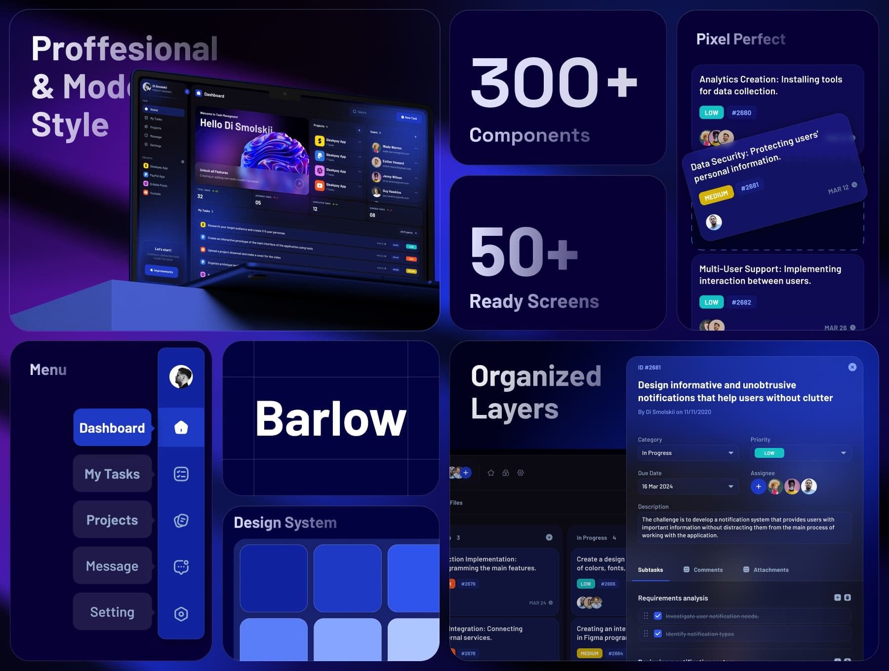
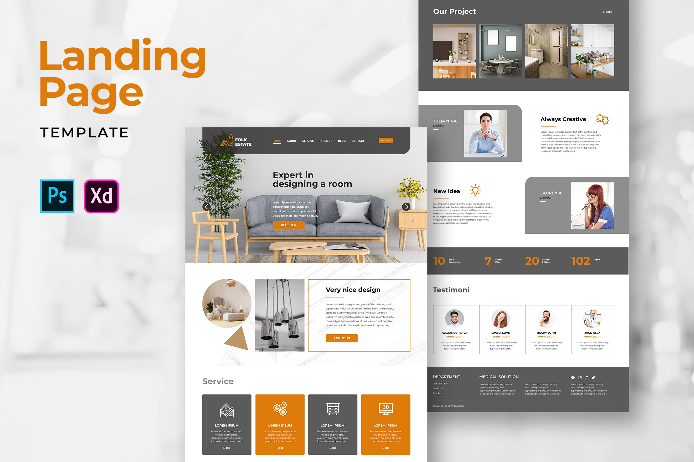

  <!-- Replace 'logo.png' with your logo file name -->
  

<h1 align="center" style="color:#1E90FF;">Hyper Solution Labs</h1>

Innovative Web & Automation Solutions | Freelance Projects

---

## 🛠 Skills

  
  
  
  
  
  

---

## 🚀 Projects

### Project 1: **3D Dashboard App**
- **Tech Stack:** React, Node.js, Three.js  
- **Demo:** [Live Demo](#)  
- **Description:** Interactive 3D dashboard showing animated charts and effects.  
- 

  <!-- Replace '3d-dashboard.gif' with your project GIF -->
  

### Project 2: **Modern Landing Page**
- **Tech Stack:** HTML, CSS, JavaScript  
- **Demo:** [Live Demo](#)  
- **Description:** Modern landing page with parallax scrolling and 3D hover effects.  
- 

  <!-- Replace 'landing-page.gif' with your project GIF -->
  

---

## 📫 Contact

  📧 Email: lynuxscorpion@gmail.com  
  🔗 LinkedIn: [Your LinkedIn](#)  
  🌐 Portfolio:(https://hypersolutionlaps.github.io/portfolio/)

---

  Made with ❤️ and 3D vibes by Hyper Solution Labs

